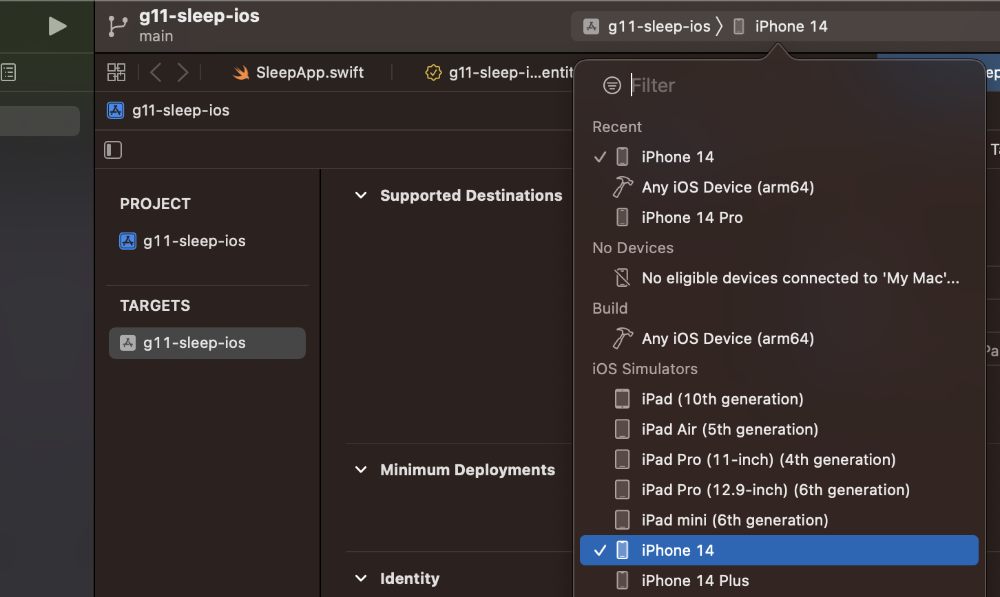

# Exersleep

The project is built in Xcode using Swift. The project can be run on any Xcode version that is greater than 14.0. The recommended Xcode version to run it immediately from cloning would be 14.2+. If run on a lesser version (still minimum 14.0), editing the target deployment version to iOS 16.0 should make the project run.

The app uses HealthKit to get access to sleep and exercise data. 

## Building the project
1. Clone the project into a desired directory
2. Open project in Xcode
3. Select an iOS Simulator as the deployment target (see screenshot)
4. Press the "play" button to build and deploy to the Simulator

## Supplying test data to HealthKit

The app requires permissions to be granted to the HealthKit data. Upon startup, a screen will be prompted to allow these permissions.
The app relies on manual input for sleep data and exercise data -- to see actual visualisations manual input is needed:
1. Open the "Health" app on the Simulator
2. Navigate to "Browse"
3. Select "Sleep"
4. In the upper-most right corner, select "Add Data"
5. Input and save data

This data will be reflected in Exersleep upon a reload.

## Troubleshooting

If the code does not build, ensure you are using Xcode version 14.0+ (preferably 14.2+). If on macOS 13.0+, ensure the Xcode version is the latest version. Should the issue persist, please reach out to s222994@student.dtu.dk.
